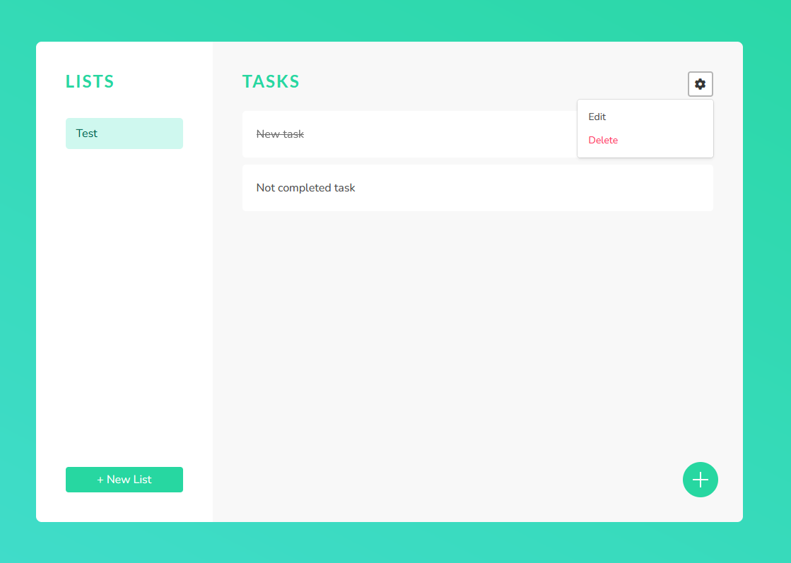

# Task Manager App



### Requirements
MongoDB pre-installed

## Installation
```
npm install -g nodemon
cd api
npm install
cd ../frontend
npm install
```

## Running:
#### Back-end:
```
cd api/
nodemon app.js
```
Once backend on ```http://localhost:3000``` is available run Front-end  
#### Front-end:  
```
cd frontend/
npm run start
```
Open http://localhost:4200

## Usage:
First go to Sign Up page and provide valid email with password with minimal length of 8  
Then you will see your task manager dashboard where you can manage your tasks and task lists

### Project structure
```
api/
    db/
        models/
            index.js
            list.model.js
            task.model.js
            user.model.js
        mongoose.js
    .gitignore
    app.js
    package.json
    package-lock.json

frontend/
    e2e/
        src/
            app.e2e-spec.ts
            app.po.ts
        protractor.conf.js
        tsconfig.e2e.json
    src/
        app/
            models/
                list.model.ts
                task.model.ts
            pages/
                edit-list/
                    edit-list.component.html
                    edit-list.component.scss
                    edit-list.component.spec.ts
                    edit-list.component.ts
                edit-task/
                    edit-task.component.html
                    edit-task.component.scss
                    edit-task.component.spec.ts
                    edit-task.component.ts
                login-page/
                    login-page.component.html
                    login-page.component.scss
                    login-page.component.spec.ts
                    login-page.component.ts
                new-list/
                    new-list.component.html
                    new-list.component.scss
                    new-list.component.spec.ts
                    new-list.component.ts
                signup-page/
                    signup-page.component.html
                    signup-page.component.scss
                    signup-page.component.spec.ts
                    signup-page.component.ts
                task-view/
                    task-view.component.html
                    task-view.component.scss
                    task-view.component.spec.ts
                    task-view.component.ts
            app.component.html
            app.component.scss
            app.component.spec.ts
            app.component.ts
            app.module.ts
            app-routing.module.ts
            auth.service.spec.ts
            auth.service.ts
            task.service.spec.ts
            task.service.ts
            web-req.interceptor.ts
            web-request.service.spec.ts
            web-request.service.ts
        asstets/
            .gitkeep
            plus-icon.svg
        environments/
            environment.prod.ts
            environment.ts
        browserlist
        favicon.ico
        index.html
        karma.conf.js
        main.ts
        main-styles.scss
        polyfill.ts
        styles.scss
        test.ts
        tsconfig.app.json
        tsconfig.spec.json
        tslist.json
    .editorconfig
    .gitignore
    angular.json
    package.json
    package-lock.json
    tsconfig.json
    tslint.json
```
